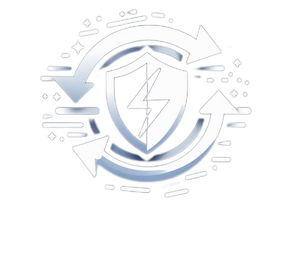
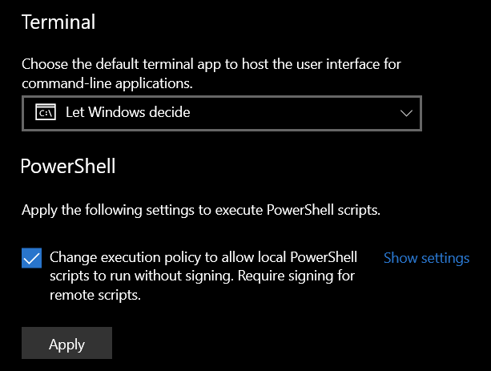

    <picture>
        <source
          width="200px"
          media="(prefers-color-scheme: dark)"
        >
        
    </picture>
     
    <b style="font-size: 16px">© 2024 by AEYCEN / 2_L_8</b>
     
    Exploit the full potential and take the advantage.
     

---

Instant player armor swap macro for Ark: Survival Evolved and Ark: Survival Ascended.

## 💪🏼 Features

Some of the features the macro provides are:

* ⚡ **In-game armor swap in just 0.5 seconds**: One pressing your configured macro hotkey, all the armor pieces currently worn by the player will be swapped with a new set prepared in the inventory within half a second
* ⌨️ **Customizable hotkey**: After launching the application, you can define your own key or key combination for the hotkey to activate the macro
* ✅ **Automatic settings recognition**: Automatically detects the in-game keybind settings set by the user
* 🔢 **Armor set counter**: Displays on-screen a counter to let you know how many armor sets you have left for change
* 🪶 **Lightweight application**: The application is very lightweight and takes up almost no storage space

## 🛠️ Installation

QuickArmorSwap does require [Python](https://www.python.org/downloads/) on the machine in order to run.
After downloading the QuickArmorSwap .zip file from GitHub, extract the files and copy the root folder to a desired location (e.g. Desktop).

### 🪟 Installation for Windows

#### ▶️ Windows 11

After that, right-click the folder and select `Open in Terminal`. 
Then, try creating the virtual environment with the following command. 

    py -3 -m venv venv

After executing the last command you shouldn't get a response. Now you can activate the virtual environment with the following command:

    venv\Scripts\activate

If it fails because of restricting Windows policies, you may activate in the Windows-Settings under `System > For developers` the slider `Change execution policy` at the bottom of the page, like shown in the screenshot below:

A green command line prefix saying `(venv)` should appear. If so, install all the required dependencies:

    pip install -r requirements.txt

#### ▶️ Windows 10

After extracting the files, go with the file explorer in the extracted QuickArmorSwap folder and click and copy its path from the Explorer address bar.
After copying it, right-click the Windows icon in the taskbar and select `PowerShell`.
Then, enter `cd` with a space and paste the copied folder path.

Now try creating the virtual environment with the following command:

    py -3 -m venv venv

After executing the last command you shouldn't get a response. Now you can activate the virtual environment with the following command:

    venv\Scripts\activate

If it fails because of restricting Windows policies, you may activate in the Windows-Settings under `Developer settings` the checkbox `Change execution policy` at the bottom of the page, like shown in the screenshot below. Don't forget to click the 'Apply' button:

> ℹ️ If you want to deactivate this setting again at some point, you have to click on "Show settings" and execute the command `Set-ExecutionPolicy -Scope CurrentUser -ExecutionPolicy Restricted` and confirm with `y`.

A green command line prefix saying `(venv)` should appear. If so, install all the required dependencies:

    pip install -r requirements.txt

### 🐧 Installation for Linux

Right-click the root folder and select `Open in Terminal`.
If you are using Ubuntu Linux, you need to install the python virtual environment library first:

    sudo apt install python3-venv

Then create the virtual environment with the following command:

    python3 -m venv venv

After executing the last command you shouldn't get a response. Now you can activate the virtual environment with the following command:

    . venv/bin/activate

A command line prefix saying `(venv)` should appear. If so, install all the required dependencies:

    pip install -r requirements.txt

## 🚀 Usage

### 🦖 In-Game preparations

1. The game needs to run in windowed or windowed full-screen mode.

2. In order for QuickArmorSwap to be able to change the armor, a folder with any name must be created in the player's inventory (however, "Armor" is recommended). 

3. For the following step, it is recommended to activate the folder view in the inventory, the button for switching is located in the upper right corner of the inventory next to the "Toggle tooltip" button.

4. Either one or more complete armor sets of any type (flak, chitin, etc.) must be moved into the folder.

QuickArmorSwap always replaces exactly one entire armor set.
The more sets there are in the folder, the more often the macro can be used to replace the set.

### ♻️ Launching QuickArmorSwap

#### 🪟 Launching on Windows

To start QuickArmorSwap, open the terminal in the QuickArmorSwap folder like described in the [installation guide](#-installation) and always activate the environment with `venv\Scripts\activate` before you run the application with the following command:

    py run.py

> ℹ️ If you want to stop the running environment (venv) after using the application, just type `deactivate`.

#### 🐧 Launching on Linux

To start QuickArmorSwap, open the terminal in the QuickArmorSwap folder like described in the installation guide and execute the following commands:

    . venv/Scripts/activate
    sudo su
    xhost +
    python run.py

> ℹ️ If you want to stop the running environment (venv) after using the application, just type `deactivate`. Additionally, you can enable the access control again with `xhost -`.

### 🏂 Using QuickArmorSwap

#### 🖥️ In the terminal (first time use only)

When launching QuickArmorSwap for the first time, you need to define some set up values:
<!--- 1. **Your Ark version**: Enter either `ase` for Ark: Survival Evolved or `asa` for Ark: Survival Ascended--->
1. **Your path to the Ark game installation folder**: Enter the full path to the `ARKSurvivalEvolved` or `Ark Survival Ascended` folder, like e.g.: `C:\Programs\Steam\steamapps\common\ARKSurvivalEvolved`. To get the path of this folder easily, find it in the file explorer, right-click it and select `Copy as path`. Then paste it in the console, *<ins>remove the quotation marks</ins>* and hit enter.
2. **Your preferred hotkey for the macro**: Enther the hotkey you would like to define to activate the macro with. You can define both individual keys on the keyboard and key combinations. In the latter case, a `+` must be added to separate the keys for input.

> Examples:
> 
> Define the `L` key as a hotkey -> Enter: `l`
> 
> Define the key combination `ALT+L` as a hotkey -> Enter: `alt+l`

Once the hotkey has been successfully defined, the application confirms that it is active with the defined hotkey.
The next time you launch QuickArmorSwap, you can instantly use it without entering any values in the console.

> ℹ️ To deactivate the application and thus the macro, press `#` once.

#### 🦖 In-game

Once QuickArmorSwap has been successfully started, go into the game and into an active session (single player or multiplayer).
Don't change the ui scaling or the keybind to open the inventory while QuickArmorSwap is running.

> ❗ **Important: Because the feature of the automatic mouseclick coordinate calculation is not implemented yet, you need to adjust the values "first_click_coordinates" and "second_click_coordinates" in the settings.txt file to your fitting.**
> 
> For that, you need to press the hotkey ingame and look where the mouseclicks happen.
> - If they are too far right, you have to reduce the value of the numbers *in front of* the commas by the same factor.
> - If the clicks are too far up, you need to reduce the value of the numbers *behind* the commas by the same factor

If you did the inventory preparations described in [In-Game preparations](#-in-game-preparations) you can now hit your hotkey and enjoy the magic.

> ❕ As soon as the macro has been started, there must be no strong mouse movement during the process, otherwise the macro cannot be executed correctly.

After activating the macro, you can see at the top of the screen for 3 seconds how many armor sets are remaining for swapping.
Once you have swapped all sets and refilled the folder, you don't have to restart QuickArmorSwap, just press `ALT+2` as many times as you have added sets back into the folder.
If you have pressed `ALT+2` one too many times, you can use `ALT+1` to reduce the number by one.

## 🪲 Troubleshooting

1. **The screen turns black and the game minimizes after pressing the hotkey**

   Your game needs to run in windowed or windowed full-screen mode. In native full-screen mode the overlay for displaying the remaining sets is not working and the screen will turn black temporarily.

2. **You want to change the hotkey for the macro**

   Delete the line with the key `hotkey` in the `settings.txt` file, save it and restart the program in the console.

*More coming soon...*

## 🔰 Version

This README file is associated with QuickArmorSwap `v0.3-beta (25.03.24)`

### ⏫ Upgrading the Version

To upgrade QuickArmorSwap to a newer version, simply delete the folder of the old version and replace it with the folder extracted from the download of the new version.

## 💫 Contact

**Development, Conception & Support**
- [AEYCEN](https://github.com/AEYCEN) (Discord: aeycen)
- [2_L_8](https://github.com/2-L-8) (Discord: 2_l_8)

Create an issue ticket on GitHub for bug reports and feature requests or join our [Discord server](https://discord.gg/N55gSQcVEC) for individual support.

## 📜 License

QuickArmorSwap is licensed under the GPLv3 licence. Please see the [license file](LICENSE) for more information.
[tl;dr](https://www.tldrlegal.com/license/gnu-general-public-license-v3-gpl-3) you may copy, distribute and modify QuickArmorSwap as long as you track changes/dates in source files.
Any modifications to QuickArmorSwap must also be made available under the GPL along with build & install instructions.
