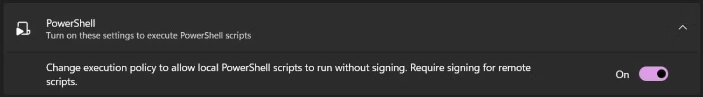

  <picture>
    <source
      width="256px"
      media="(prefers-color-scheme: dark)"
    >
    
  </picture>
    
  <b style="font-size: 16px">© 2024 by AEYCEN / 2_L_8</b>
    
   Exploit the full potential and take the advantage.

# ARK:SE QuickArmorChange

Instant player armor swap macro for Ark: Survival Evolved.

## 💪🏼 Features

Some of the features the macro provides are:

* 🛡️ **In-game armor swap in just 1 second**: When the macro is activated, all the armor pieces currently worn by the player will be swapped with a new set prepared in the inventory within one second
* ⌨️ **Customizable hotkey**: When starting the application, the user can define their own key or key combination for the hotkey to activate the macro
* 🪶 **Lightweight application**: The application is very lightweight and takes up almost no storage space

## 🛠️ Installation

### Virtual Environment & Dependencies

QuickArmorChange does require [Python](https://www.python.org/downloads/) >= 3.10 on the machine in order to run.

After downloading the .zip file, extract the files and copy the root folder to a desired location (e.g. Desktop). 
After that, right-click the folder and select `Open in Terminal`. 
Then, try creating the virtual environment with the following command. 
If it fails because of restricting windows policies, you may activate the slider `Change execution policy` in the Windows-Settings under `System > For developers`, shown in the screenshot below:

    py -3 -m venv venv

After executing the last command you shouldn't get a response. Now you can activate the virtual environment with the following command:

    venv\Scripts\activate

A green command line prefix saying `(venv)` should appear. If so, install all the required dependencies:

    pip install -r requirements.txt

## 🚀 Usage

To start QuickArmorChange, open the terminal in the QuickArmorChange folder like described in the installation guide and always activate the environment with `venv\Scripts\activate` before you run the application with the following command:

    py run.py

ℹ️ If you want to stop the running environment (venv) after using the application, just type `deactivate`.

## 📖 Imprint

**Development, Conception & Support**
- [AEYCEN](https://github.com/AEYCEN) (Discord: aeycen)
- [2_L_8](https://github.com/) (Discord: 2_l_8)

Create an issue ticket on GitHub for bug reports and feature requests or join our [Discord server](https://discord.gg/N55gSQcVEC) for individual support.

## 📜 Licence

QuickArmorChange is licensed under the GPLv3 licence. Please see the [licence file](LICENSE) for more information.
[tl;dr](https://www.tldrlegal.com/license/gnu-general-public-license-v3-gpl-3) you may copy, distribute and modify QuickArmorChange as long as you track changes/dates in source files.
Any modifications to QuickArmorChange must also be made available under the GPL along with build & install instructions.