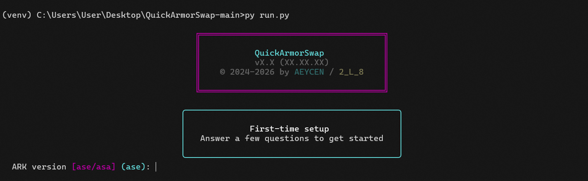
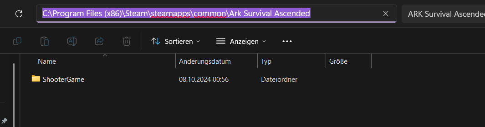
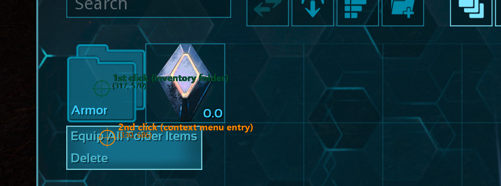
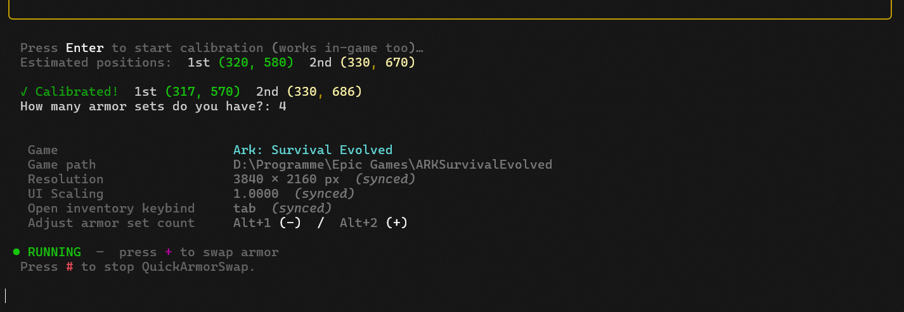

## ✨ First-Time Setup

When you launch QuickArmorSwap for the first time, a guided setup wizard walks you through the configuration. All your settings are saved in `settings.txt` and remembered for future launches.

### 1. ARK version

You'll be asked which ARK version you're using:

| Input | Game |
|-------|------|
| `ase` | Ark: Survival Evolved |
| `asa` | Ark: Survival Ascended |

After choosing, you'll be asked: **"Ask for game version on every start?"**

- **Yes** — Every time you launch QuickArmorSwap, you can choose between ASE and ASA. Your last selection is the default (just press Enter to keep it). This is ideal if you play both games.
- **No** — The version you chose is used on every start without asking. You can always change this later in `settings.txt`.

> Game paths, calibrated coordinates, and UI scaling are stored **separately** for each version. Switching between ASE and ASA does not lose any settings — everything is remembered independently.

### 2. Game folder path

Enter the **full path** to your game's root folder:

| Version | Expected folder name | Example path                                                                          |
|---------|---------------------|---------------------------------------------------------------------------------------|
| **ASE** | `ARKSurvivalEvolved` | `C:\Program Files\Epic Games\ARKSurvivalEvolved` (Epic Games example)                 |
| **ASA** | `Ark Survival Ascended` | `C:\Program Files (x86)\Steam\steamapps\common\Ark Survival Ascended` (Steam example) |

**How to find this path on Steam:**
1. Open Steam
2. Right-click the game in your library
3. Select **Manage → Browse local files**
4. Copy the path from the File Explorer address bar

Each version's path is only asked once. If you later switch to the other version (e.g. from ASE to ASA), you'll be asked for that version's path on first use.

> **What gets synced from the game folder:**
>
> QuickArmorSwap reads the following from your game's config files on every launch:
>
> | Setting | Source file | Fallback if not found |
> |---------|-----------|----------------------|
> | Inventory keybind | `Input.ini` | Default key `I` |
> | UI scaling | `GameUserSettings.ini` | Default `1.0` |
> | Resolution | `GameUserSettings.ini` | Current screen resolution |
>
> The config files are located at:
> - **ASE:** `<game folder>\ShooterGame\Saved\Config\WindowsNoEditor\`
> - **ASA:** `<game folder>\ShooterGame\Saved\Config\Windows\`
>
> These values are **never saved** to `settings.txt` — they are re-read from the game files every time. If you change your inventory keybind or UI scaling in ARK, QuickArmorSwap picks it up automatically on the next launch.

### 3. Macro hotkey

Enter the key or key combination you want to use to trigger the armor swap. Examples:

| Input | Meaning |
|-------|---------|
| `l` | Press the L key |
| `+` | Press the + key |
| `alt+l` | Hold Alt and press L |
| `ctrl+shift+l` | Hold Ctrl+Shift and press L |

Choose a key that doesn't conflict with any ARK keybinds.

### 4. Deactivation hotkey

Enter the key you want to use to stop QuickArmorSwap. For example `#` or `esc`. This key works globally — even while ARK has focus.

### 5. Coordinate calibration

This is the most important step. QuickArmorSwap needs to know exactly where on your screen the armor folder and the equip button are located.

An overlay with **two crosshair markers** will appear on top of your screen:

| Marker | Color | What to place it on                                                                                       |
|--------|-------|-----------------------------------------------------------------------------------------------------------|
| **1st marker** | 🟢 Green | The **armor folder** in your inventory (right-click target)                                               |
| **2nd marker** | 🟠 Orange | The **"Equip All Folder Items" option** in the dropdown menu that appears after right-clicking the folder |

**Controls during calibration** (these work globally — even when ARK has focus):

| Key | Action |
|-----|--------|
| `Arrow keys` | Move the active marker by 1 pixel |
| `Shift + Arrow keys` | Move the active marker by 10 pixels |
| `Enter` | Confirm the current marker position |
| `Esc` | Cancel calibration |

**How to calibrate:**

1. When asked "Press Enter to start calibration", open ARK and go into a session
2. Open your inventory so the armor folder is visible
3. Press **Enter** (works even while ARK has focus)
4. Position the **green marker** directly on your armor folder and press **Enter**
5. Right-click the folder so the dropdown menu appears
6. Position the **orange marker** on the "Equip Items" option and press **Enter**
7. Done! The coordinates are saved automatically

> **Tip:** Use `Shift + Arrow keys` for big adjustments, then fine-tune with regular arrow keys.

> **Note:** Coordinates are stored separately per game version. If you switch from ASE to ASA (or vice versa) and haven't calibrated for that version yet, the calibration wizard will run again.

### 6. Armor set count

Enter how many armor sets are currently in your folder. This number is shown on the in-game overlay and decremented each time you use the macro.

After this, QuickArmorSwap is fully configured and running:

## ⏭️ Next steps

- **Continue: [🎮 Using QuickArmorSwap In-Game](usage.md)**

- *Back*:
  - [🚀 Launching QuickArmorSwap](launching.md)
  - [Startpage](https://github.com/AEYCEN/QuickArmorSwap)