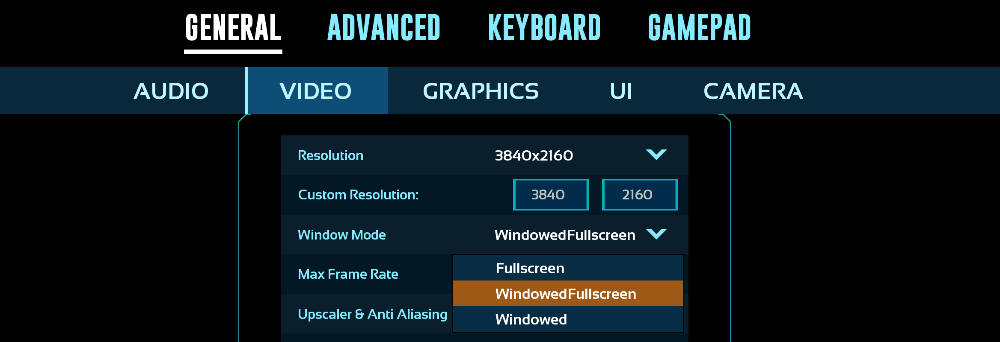
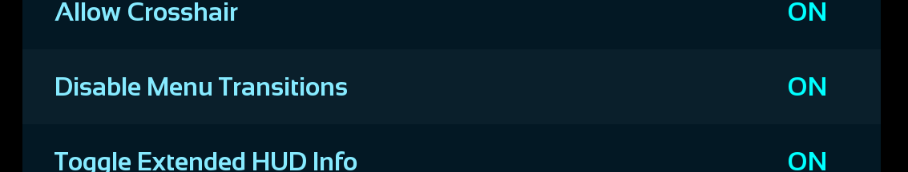
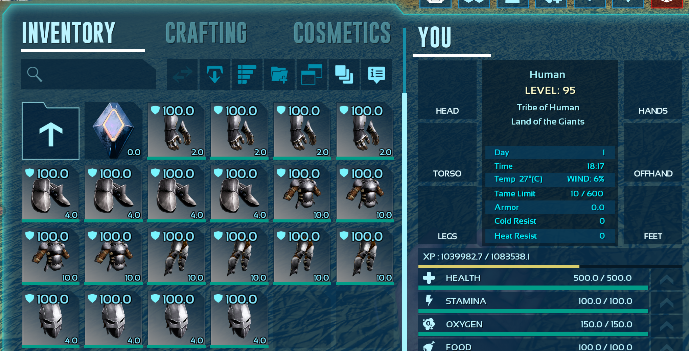

# 🦖 In-Game Preparations

Before using QuickArmorSwap, you need to prepare a few things inside ARK. These steps apply to both ASE and ASA unless noted otherwise.

## 1. Set windowed mode

The game **must** run in **Windowed** or **Windowed Fullscreen** mode. Native fullscreen is not supported and will cause the screen to turn black when the overlay appears.

## 2. Enable "Disable Menu Transitions"

This is **required**. Without it, the inventory animation delay will cause the macro to click in the wrong places.

1. Open ARK
2. Navigate to the setting **"Settings → General → UI"**
3. Check **"Disable Menu Transitions"**
4. Click **Apply** and **Save**

> QuickArmorSwap checks this setting automatically on launch and will show an error with step-by-step instructions if it's not enabled.

## 3. Create an armor folder in your inventory

1. Open your inventory
2. Create a new folder (the name doesn't matter, but "Armor" is recommended)
3. It is recommended to enable **folder view** in the inventory — the toggle button is in the upper-right corner of the inventory, next to the "Toggle tooltip" button

## 4. Fill the folder with armor sets

Move one or more **complete** armor sets (helmet, chest, gloves, legs, boots) of any type into the folder. Each set equals one macro use. The more sets you have, the more often you can swap before needing to restock.

## ⏭️ Next steps

**Continue with [🚀 Launching QuickArmorSwap](launching.md)**

*Or go back to*:
  - [🛠️ Installation](installation.md)
  - [🦖 Ark: Survival Evolved In-Game Preparations](in-game-preperations-ASE.md)
  - [Startpage](https://github.com/AEYCEN/QuickArmorSwap)