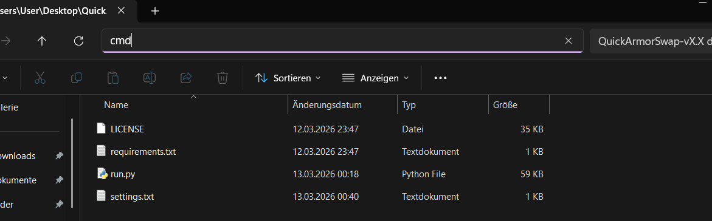
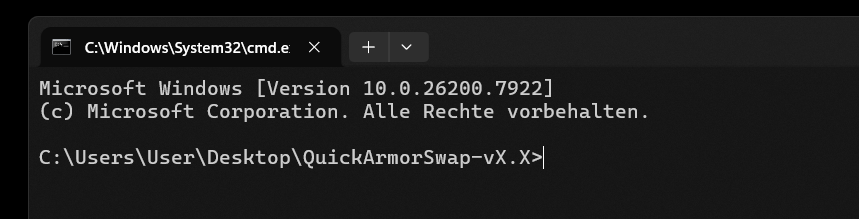
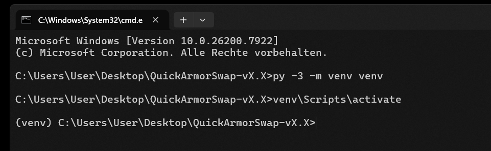

# 🛠️ Installation

## Step 1 — Download and extract

1. Download the latest `QuickArmorSwap-vX.X (zip)` file from the [GitHub releases page](https://github.com/AEYCEN/QuickArmorSwap/releases).
2. Extract it and copy the folder to a location of your choice (e.g. your Desktop).

## Step 2 — Open a Command Prompt in the folder

Open the QuickArmorSwap folder in File Explorer. Click the address bar at the top, type `cmd`, and press Enter. A Command Prompt window will open, already set to the correct folder.




## Step 3 — Create a virtual environment

Run the following command to create an isolated Python environment:

```
py -3 -m venv venv
```

You should not see any output — that means it worked.

## Step 4 — Activate the virtual environment

```
venv\Scripts\activate
```

You should see a `(venv)` prefix appear before the command prompt.



## Step 5 — Install dependencies

With the virtual environment active (you see `(venv)` in your prompt), run:

```
pip install -r requirements.txt
```

Wait for the installation to complete. You're ready to go.

## ⏭️ Next steps

- **Continue:** 
  - [🦖 **Ark: Survival Ascended** In-Game Preparations](in-game-preperations-ASA.md)
  - [🦖 **Ark: Survival Evolved** In-Game Preparations](in-game-preperations-ASE.md)


- *Back:*
  - [📋 Requirements](requirements.md)
  - [Startpage](https://github.com/AEYCEN/QuickArmorSwap)