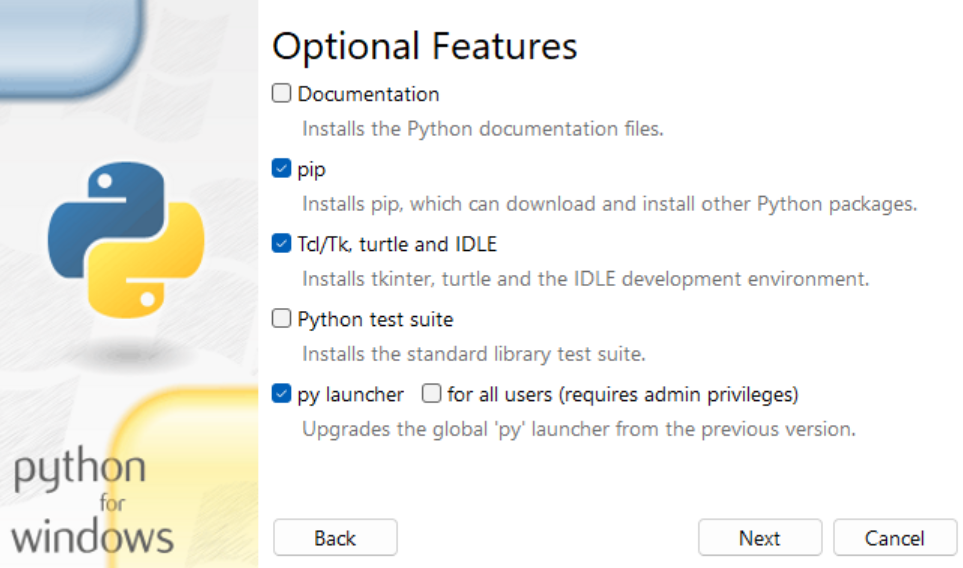
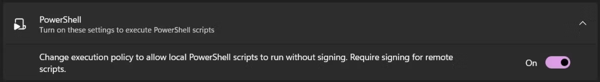
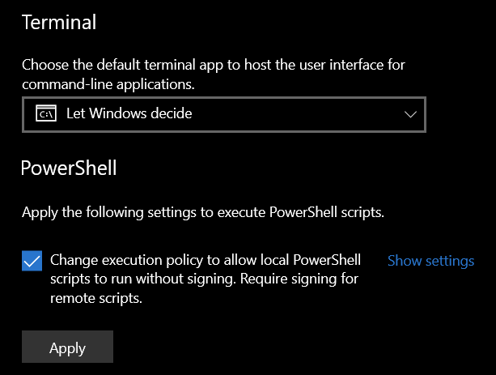

# ❔ Troubleshooting

## The screen turns black and the game minimizes after pressing the hotkey

Your game is running in native fullscreen. Switch to **Windowed** or **Windowed Fullscreen** mode in ARK's display settings.

## "Required ARK setting not enabled!" error on launch

You need to enable **"Disable Menu Transitions"** in ARK:
- **ASE:** Options → Advanced
- **ASA:** Settings → General → UI

## "GameUserSettings.ini not found" error

Make sure you've launched ARK at least once so the config files are created, and that the game path in `settings.txt` points to the correct folder.

## The macro clicks in the wrong places

Re-run the calibration by deleting the coordinate and scaling lines for your version from `settings.txt`. For example, for ASE delete:
```
ase_first_click_coords=...
ase_second_click_coords=...
ase_saved_ui_scaling=...
```
Then restart QuickArmorSwap.

## I want to change my hotkey

Delete the `hotkey=...` line from `settings.txt`, save, and restart. You'll be asked to enter a new one.

## The inventory keybind shows "(default)" but I have a custom keybind in ARK

QuickArmorSwap reads the keybind from `Input.ini` in your game's config folder on every launch. If it shows "(default)", the file either doesn't exist or doesn't contain a `ShowMyInventory` entry. Make sure you've customized the keybind _inside ARK_ (not just in an external config editor) and that the game has been launched at least once since.

## The counter shows the wrong number after restocking

Use `Alt+2` to increment the count for each set you added back to the folder. Use `Alt+1` if you went one too high.

## The set count overlay crashes or doesn't appear

You probably installed Python without enabling the **"Tcl/Tk, turtle and IDLE"** option. Reinstall Python and make sure this option is checked during installation.



## The installation fails due to restricting Windows policies

### Windows 11

You may activate in the Windows-Settings under `System > For developers` the slider `Change execution policy` at the bottom of the page, like shown in the screenshot below:




### Windows 10

You may activate in the Windows-Settings under `Developer settings` the checkbox `Change execution policy` at the bottom of the page, like shown in the screenshot below. Don't forget to click the 'Apply' button.




## ⏭️ Next steps

- **Continue: [Back to Startpage](https://github.com/AEYCEN/QuickArmorSwap)**


- *Back*:
  - [⚙️ Configuration](configuration.md)
  - [Startpage](https://github.com/AEYCEN/QuickArmorSwap)